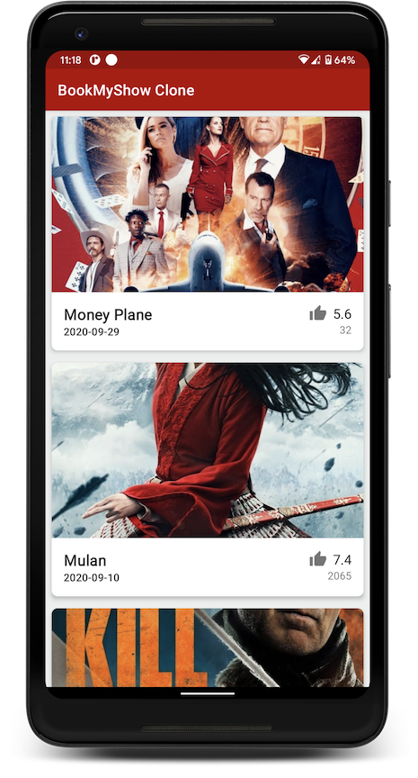

# Devfest India 2020 Mobile Track


This is the repo for the mobile track of Devfest India 2020. You can use this repo as your reference to check all the topics that got covered over 3 days.

## Targeted audience  :family: 
This repo is for those who wanted to kickstart android development or just started and looking for a reference app that will teach them a few advanced concepts.

## Goal  :dart:
The goal of the DevFest 2020 mobile track is to teach you Android development covering basics, intermediate, and advanced topics by creating a BookMyShow movie listing clone. The mobile track is divided into 3 levels
1. Beginner - Covering Android UI basics.
2. Intermediate - Covering [Retrofit](https://square.github.io/retrofit/) to make an API request to remote server and [RecyclerView](https://developer.android.com/guide/topics/ui/layout/recyclerview).
3. Expert - Covering MVVM architecture and [Room](https://developer.android.com/topic/libraries/architecture/room) Database for offline support.

In the end, you will get an app with a nice movie listing UI supporting offline access.


## How to use this repo to follow sessions? :technologist:

Repo has 3 branches beginner, intermediate, and expert. 
Day 1 starts with creating a fresh project and the beginner branch is a snapshot of that. The intermediate branch is a snapshot of the end of day 1. Day 2 starts from the intermediate branch and leads you to the expert branch. Finally, day 3 starts with the expert branch and leads you to the master branch.

So if you know the basics of android development and join us directly on day 2 checkout the intermediate branch and follow along. Similarly, if you are joining us directly on the day 3 checkout expert branch and follow along.

> Please note we are using [the movie DB API](https://developers.themoviedb.org/3) to get movies from the remote server.
To get movies from API you would need an API key. 
>
> Try this in your [MainViewModel](https://github.com/DevFest-India/devfest-india2020-android/blob/cd5780f08dc4c54542459a97cb1c99363f4ced75/app/src/main/java/com/devfest/india/bmsclone/ui/MainViewModel.kt#L17): 
>    ```kotlin
>    companion object {
>        private const val API_KEY = "7bc0651fe0ea5973822df3bd27e779d9"
>    }
>    ```
> We would recommend to generate your own API key and use it if above key is not working. Please follow the below steps to configure your own API key. 
>
>1. Register yourself on https://www.themoviedb.org/signup 
>2. Fill all the required details to signup. 
>3. Open your email and verify the email to get started. (Activate your account)
>4. Do login with the username and the password(you provided during signup)
>5. On Top right corner -> Click on your profile icon -> Settings -> API  -> Request an Api Key -> Choose developer option(for demo/sample project ) -> Accept the terms -> Fill all the required details (You can give dummy value for application url as you won’t be having that, give good summary for application summary) -> Submit -> Copy API key in [MainViewModel](https://github.com/DevFest-India/devfest-india2020-android/blob/cd5780f08dc4c54542459a97cb1c99363f4ced75/app/src/main/java/com/devfest/india/bmsclone/ui/MainViewModel.kt#L17).
>
>Also, note that this will be required for Day 2 where we hit API using retrofit

## Gist for each session :page_facing_up:
Each session requires you to copy-paste a few files. Please find the gist of all files required session wise below.

Day 01

- [build.gradle](https://gist.github.com/sagar-viradiya/ea05cdeb8471ca028dd361e53512189e) file
- [colors.xml](https://gist.github.com/sagar-viradiya/914d9e57980d2d6979c43a8653308e7b) file
- [activity_main.xml](https://gist.github.com/sagar-viradiya/64b6a8331b3f4d436ae499b9700ac1f4) file

Day 02

- [API key instructions](https://gist.github.com/sagar-viradiya/53020459385422686b025007a3cfc944)
- [Movie.kt](https://gist.github.com/sagar-viradiya/4b27d42dc2ee8c24f21cbd5ae20d4f03) file
- [NetworkHelper.kt](https://gist.github.com/sagar-viradiya/18ec984f6bea85337eab1770900c65aa) file
- [URLs.txt](https://gist.github.com/sagar-viradiya/9d14a83a4f2dc4767d987e1b8aabb85e) file

## Screenshot


